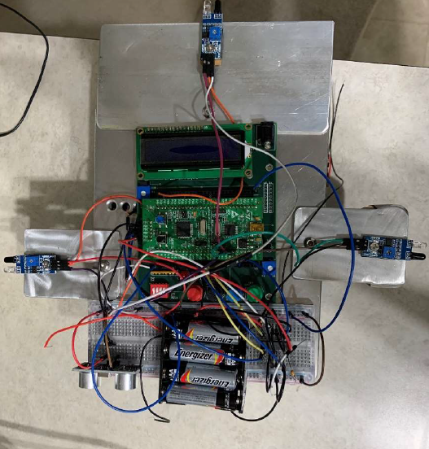
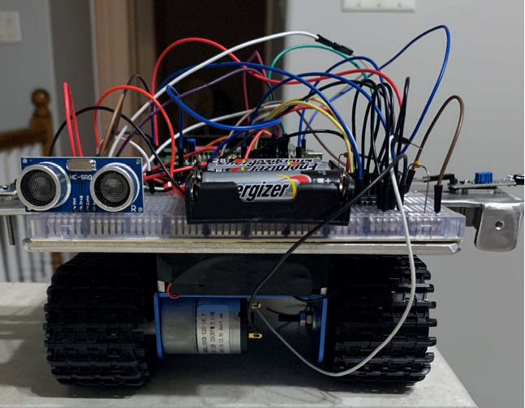

<h1 align="center" style="font-size:100px" >
  Microcomputer Systems Engineering
</h1>

This project is an electronic system for ENEL387 Microcomputer System Design based on the STM32F100 ARM Cortex-M3 micro controller and ENEL384 carrier board. My partner and I designed, implemented and deployed software to create a embedded robotic vehicle implemented in C to avoid objects using a series of digital and analog sensors. In addition to creating working software we also build the complete system from various online retailers. Here are pictures of our completed system:  

<table align="center">
  <tr>
    <td align="center">Top View</td>
    <td align="center">Back View</td>
  </tr>
  <tr>
    <td></td>
    <td></td>
  </tr>
</table>

## Table of contents
- [Project Development](#project-development)
  - [Design Documentation](#design-documentation)
  - [Reporting Documentation](#reporting-documentation)
- [Project Code](#project-code)
- [System Requirements](#system-requirements)
- [Contributors](#contributors)
- [Credits](#credits)

## Project Development
#### Design Documentation
> [Project Proposal](ProjectDocumentation/Design/387ProjectProposal.pdf): Includes the inital design proposal (Pre COVID-19)   
> [Robot Schematic](ProjectDocumentation/Design/RobotSchematic.pdf): Final robot schematic (Includes pin map)

#### Reporting Documentation
> [Project Report](ProjectDocumentation/Reporting/ProjectReport.pdf): This document is overview of the system design and the breakdown of the design decisions (Includes post COVID-19 modifications)

## Project Code
> [Project Code](ProjectCode): Find all our code here

## System Requirements
- **Software**: Keil uVision5
- **Language**: C

## Contributors
[Mckenzie Busenius](https://github.com/macbusenius)   
Gunjeet Dhaliwal

## Credits
#### Speacial Thanks:
- Dr. Lei Zhang
  - Microcomputer Systems Design Professor
- Dave Duguid
  - Microcomputer Systems Design Lab Professor
